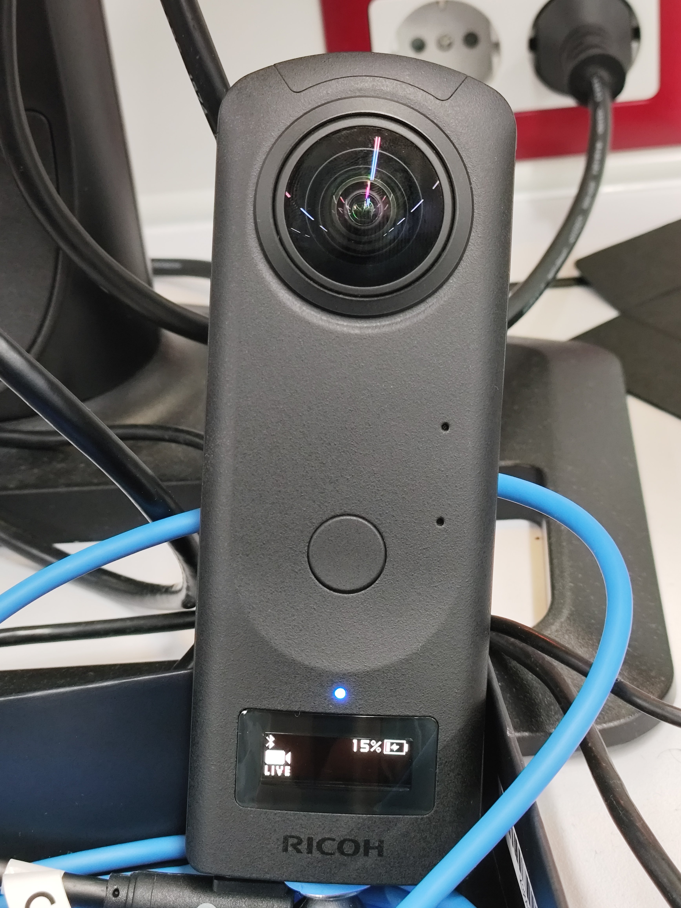
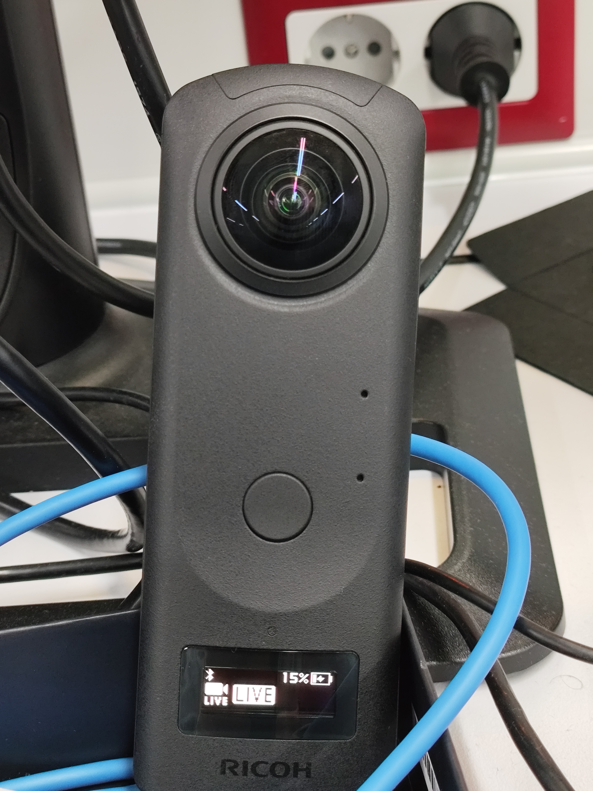

# Ricoh THETA Z1 ROS 2 Driver

This package provides a ROS 2 node (`theta_driver::ThetaDriver`) to stream video from the **Ricoh THETA Z1** in dual-fisheye UVC mode, decode it via GStreamer, and publish the image to ROS 2 topics.

## Features

- Support for 1920x960 (FHD) and 3840x1920 (4K) streaming
- Real-time decoding and publishing via GStreamer pipeline
- Publishes stitched RGB image to ROS 2
- Fully integrated with `rclcpp` and `sensor_msgs`

---

## Installation

### 1. System Dependencies

```bash
sudo apt install \
  libgstreamer1.0-dev \
  libgstreamer-plugins-base1.0-dev \
  libgstreamer-plugins-bad1.0-dev \
  libglib2.0-dev \
  libusb-1.0-0-dev \
  libopencv-dev
```

### 2. libuvc (if not installed via apt)

```bash
git clone https://github.com/libuvc/libuvc.git
cd libuvc
mkdir build && cd build
cmake ..
make && sudo make install
```

### 3. Build the ROS 2 Package

```bash
cd ~/ros2_ws/src
git clone https://github.com/RubenCasal/ricoh_theta_z1_node.git
cd ..
colcon build --packages-select ricoh_theta
source install/setup.bash
```

---

## Usage

```bash
ros2 run ricoh_theta theta_node
```

### Available Parameters

| Parameter        | Type    | Description                                  | Default          |
|------------------|---------|----------------------------------------------|------------------|
| `use4k`          | `bool`  | Enable 4K resolution                          | `false`          |
| `serial`         | `str`   | Device serial number to connect              | `""`             |
| `camera_frame`   | `str`   | Frame ID for the image messages              | `"camera_link"`  |
| `pipeline`       | `str`   | Custom GStreamer pipeline string             | *preset default* |

Example:

```bash
ros2 run ricoh_theta theta_node --ros-args -p use4k:=true -p camera_frame:=theta_frame
```

---

## Published Topics

| Topic             | Type                        | Description                     |
|-------------------|-----------------------------|---------------------------------|
| `/stitched_image` | `sensor_msgs/msg/Image`     | Stitched RGB image from camera |

---

## How to Enable Live Streaming Mode on the THETA Z1

Before launching the node, you need to manually switch the camera to UVC (live streaming) mode:

1. **Connect the THETA Z1 via USB** to your computer.
2. **Power on** the camera using the power button.
3. **Press the MODE button** repeatedly until you see a small `LIVE` icon on the screen.

- The icon indicates that the camera is ready to stream in UVC mode.
<p align="center">

</p>
- When streaming is active, a **larger `LIVE` icon** will appear (see below).
<p align="center">

</p>

---

